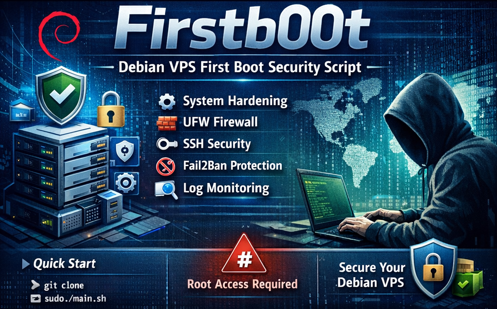

# 🚧 repo in development - DO NOT USE yet 🚧



# 🚀 Firstb00t — your Debian server's first safe steps

[](https://media.defense.gov/2022/Jun/15/2003018261/-1/-1/0/CTR_NSA_NETWORK_INFRASTRUCTURE_SECURITY_GUIDE_20220615.PDF) [](https://tuxcare.com/wp-content/uploads/2024/04/TuxCare_Cybersecurity_Misconfigurations_playbook.pdf) [](https://github.com/punkyard/firstb00t/releases) []()

**Firstb00t** is an automated security setup for your brand-new **Debian server**. 

Think of it as a trusted checklist that runs on your very first connection to your new VPS — making sure everything is locked down and secure, without you needing to be a Linux expert.

---

## 💡 What Is This?

You just spun up a fresh Debian server (on Contabo, Linode, DigitalOcean, or anywhere else). Before you deploy your app, you need to:

- ✅ Update the system (security patches)
- ✅ Create a secure login (not root)
- ✅ Harden SSH (stronger protection)
- ✅ Set up a firewall (block bad traffic)
- ✅ Monitor what's happening (logs & alerts)

**Firstb00t does all this automatically**, safely, and the right way. No scary commands. No guessing. Just run it, answer a few questions, and you're done.

### 🛡️ Built on security standards

Firstb00t implements **95%+ compliance** (39 of 41 requirements) with:
- [NSA Network Infrastructure Security Guide](https://media.defense.gov/2022/Jun/15/2003018261/-1/-1/0/CTR_NSA_NETWORK_INFRASTRUCTURE_SECURITY_GUIDE_20220615.PDF) (U/OO/118623-22, October 2023)
- [TuxCare Top 10 Cybersecurity Misconfigurations](https://tuxcare.com/wp-content/uploads/2024/04/TuxCare_Cybersecurity_Misconfigurations_playbook.pdf) cybersecurity playbook

This means your server follows enterprise-grade security practices from day one, including:
- ✅ System update rollback capability (timeshift snapshots)
- ✅ APT signature verification enforcement
- ✅ DNSSEC validation for DNS lookups
- ✅ Multi-factor authentication (TOTP)
- ✅ SSH key-based authentication only
- ✅ Intrusion detection and log monitoring
- ✅ Encrypted backups with BorgBackup (deduplication + retention)
- ✅ Multi-host SSH orchestration for centralized backup management

---

## 🎯 Who is this for?

- 🟢 **beginners**: First server? No problem. We handle the hard stuff.
- 🟡 **small teams**: Deploy consistently across multiple servers.
- 🟢 **DevOps engineers**: Reproducible, auditable, idempotent.

**You don't need to be a Linux expert.** If you can copy-paste commands and say yes to a few prompts, you're good.

---

## 🚀 Quick start

**Prerequisites:** get your VPS credentials from your provider**
- 🔑 IP address (e.g., IPv4 `203.0.113.42` and/or IPv6 `2001:db8:85a3::8a2e:370:7334`)
- 🔑 root password or existing SSH access

**🖥️ **   

**🎯 Single command** (macOS, Linux, or WSL):

Open a terminal window and open a folder to download the firstb00t script (eg, ~/Downloads)

```bash
cd ~/Downloads
curl -O https://raw.githubusercontent.com/punkyard/firstb00t/main/firstb00t.sh && bash firstb00t.sh
```

### 🛠️ What happens next

**Step 1: 🖥️ Local preparation**
- detects existing SSH keys (id_ed25519, id_rsa)
- **option A:** use your existing key
- **option B:** create dedicated key for this VPS: `~/.ssh/firstb00t_vps`
- detects your public IP(s) for firewall allowlist
- prints connection command to connect to server

**Step 2: 🚀 VPS setup**
- connect to VPS using the provided SSH command
- download and run the setup script:
  ```bash
  cd /home
  curl -sSfL https://raw.githubusercontent.com/punkyard/firstb00t/main/setup/debian.sh -o debian.sh
  chmod +x debian.sh
  bash debian.sh
  ```

  _If `curl` is not available, you can use `wget` instead:_
  ```bash
  wget https://raw.githubusercontent.com/punkyard/firstb00t/main/setup/debian.sh -O debian.sh
  chmod +x debian.sh
  bash debian.sh
  ```

  _To install `wget`:_
  - Debian/Ubuntu: `sudo apt update && sudo apt install wget -y`
  - macOS: `brew install curl`

- script performs early system preparation (apt update, sudo user creation)
- switches to sudo user for continued execution
- **first-time connection:** type `yes` when asked about fingerprint verification

**Step 3: ✅ Automated hardening (runs on VPS)**
The setup script will ask:
- 🔹 **security level?** (BASIC / STANDARD / ADVANCED / STEP BY STEP)
  - **BASIC** = essentials (everyone needs this)
  - **STANDARD** = production-ready (email, SSL, backup)
  - **ADVANCED** = maximum security (intrusion detection)
  - **STEP BY STEP** = interactive module selection (choose each component individually)
- 🔹 **username for login?** (e.g., `vps-admin`)
- 🔹 **custom SSH port?** (default: `22022`, not `22`)
- 🔹 **SSH public key?** (paste from your local terminal output)

**That's it!** 🎉 Everything else is automated.

---

## 📊 What gets installed?

### BASIC security (all servers)
- **system updates** — latest security patches
- **user management** — create a safe login (non-root)
- **SSH hardening** — stronger, safer remote access (custom port)
- **firewall (UFW)** — block bad traffic automatically
- **monitoring** — watch for problems and log everything

### STANDARD (production servers)
All basic, plus:
- **Fail2Ban** — block brute-force attacks
- **SSL/TLS** — certificates for HTTPS
- **DNS Security** — safer domain lookups
- **mail setup** — secure email (if you need it)
- **backup** — 📦 BorgBackup encrypted backups with retention
- **orchestration** — 🔗 multi-server SSH coordination

### ADVANCED (high-security)
All standard, plus:
- **Intrusion Detection** — OSSEC watches 24/7
- **App Armor** — extra container/app protection
- **Custom Hardening** — for experts

### 🔄 New Features (Latest Update)
- **Step-by-Step Profile**: Interactive module selection for custom setups
- **Immediate Security**: apt update and sudo user creation happen first on server
- **Ping Protection**: Server doesn't respond to ping (ICMP echo) for reduced visibility
- **Aggressive Fail2ban**: Bans non-SSH-key attempts immediately and permanently
- **User Context**: Runs as dedicated sudo user after initial setup

---

## ✅ After it finishes

### Test your new login
```bash
# SSH on the new port (22022)
ssh -p 22022 admin@your-server-ip
```

### Check the firewall
```bash
sudo ufw status
```

### View the logs
```bash
# Everything that happened is logged here:
less /var/log/firstboot/system_updates.log
less /var/log/firstboot/ssh_hardening.log
less /var/log/firstboot/firewall.log
```

---

## 🛡️ Security features

<details>
<summary><strong>click to see security features explained</strong></summary>

For detailed feature descriptions and module documentation, see [modules-features.md](modules-features.md)

### 1. **System updates**
We get all the latest security patches — like Windows Update, but for Linux.

### 2. **User management**
Root is the "superuser" — dangerous to use every day. We create a safer daily user for you.

### 3. **SSH hardening**
- move SSH to a custom port (port 22022 instead of 22)
- require SSH keys (not passwords — much safer)
- disable direct root login
- disable outdated login methods

### 4. **Firewall (UFW)**
Think of it as a bouncer at a club. By default, no one gets in. Only traffic we explicitly allow (SSH, HTTP, HTTPS) gets through.

### 5. **Fail2Ban** (Standard+)
If someone tries to guess your password 5 times, they get blocked automatically for 10 minutes. Stops brute-force attacks.

### 6. **Monitoring**
Logs everything that happens. If something goes wrong, you can see what happened.

</details>

---

## ⏮️ Oops, something broke?

<details>
<summary><strong>click for rollback & troubleshooting guide</strong></summary>

Don't panic. Everything is **reversible**. Each change we make has a backup:

```bash
# See what went wrong
less /var/log/firstboot/firewall.log

# Rollback SSH hardening (if you're locked out)
sudo cp /etc/ssh/sshd_config.bak /etc/ssh/sshd_config
sudo systemctl restart sshd

# Disable the firewall (emergency only)
sudo ufw disable
```

**Still stuck?** Open an issue on GitHub. We'll respond. 🙂

</details>

---

## 🔄 Can I run it again?

<details>
<summary><strong>click to learn about idempotence</strong></summary>

Yes! The script is **idempotent** — that means:
- ✅ run it once = secure server
- ✅ run it twice = same secure server (nothing breaks)
- ✅ run it with different settings = updates safely

You can update your firewall rules, add a new user, change things — just re-run the script.

</details>

---

## 📚 Learn more

- read **module documentation** in [modules/](modules/) for detailed features and implementation guides

---

## 🐛 Found a bug?

<details>
<summary>📖 <strong>click for issue reporting guide</strong></summary>

- **problems during setup?** [open an issue](https://github.com/punkyard/firstb00t/issues)
- **have an idea?** [suggest it in discussions](https://github.com/punkyard/firstb00t/discussions)
- **roadmap?** check [github issues](https://github.com/punkyard/firstb00t/issues?q=is%3Aissue+is%3Aopen+label%3Aenhancement) for planned features

**issue template:** include
1. OS/VPS provider used
2. what happened
3. what you expected
4. log output from `/var/log/firstboot/`

</details>

---

This project is free software. You can use, modify, and redistribute it freely — as long as you share any improvements back with the community.

<div align="center">

GNU Affero General Public License v3 (AGPLv3) — see [LICENSE](./LICENSE)</br>

made with ⏳ by <a href="https://github.com/punkyard">punkyard</a>

</div>

